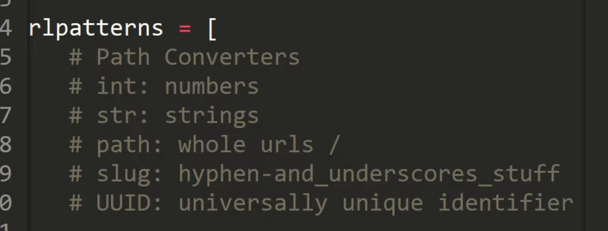

# **self taught diary**
## This is the diary for my journey to becoming a developer job by self-taught coding.

i'll keep every it concise and concludes what i've done on the day.
task of the day can be any of the bellow:
- solve problem on leetcode
- contribute on github
- build up own project
- learn something new

i know the journey may be very long and tough. i may pivat my target a few times.
but how can i view the scene without starting the journey. 
let's go.


interesting projects to do:
- personal profile page
- slot booking system
- backtesting framework

---
quick jump
1. [05062023](#05062023)
2. [06062023](#06062023)
3. [07062023](#07062023)
4. [08062023](#08062023)
5. [09062023](#09062023)
6. [10062023](#10062023)
7. [11062023](#11062023)
8. [12062023](#12062023)
9. [13062023](#13062023)
---
## 05062023
- [x] work on leetcode 226, met the binary tree. 

the main takeaway is its sturcture and insert function that i can build a tree for testcase simulation
```python
# data structure:
class TreeNode(object):
    def __init__(self,val=0,left=None,right=None):
        self.val=val
        self.left=left
        self.right=right
# inset function
    def insert(self,val):
        if self.val:
            if val<self.val:
                if self.left is None:
                    self.left=TreeNode(val)
                else:
                    self.left.insert(val)
            elif val>self.val:
                if self.right is None:
                    self.right=TreeNode(val)
                else:
                    self.right.insert(val)
        else:
            self.val=val
# print tree
    def PrintTree(self):
        if self.left:
            self.left.PrintTree()
        print(self.val)
        if self.right:
            self.right.PrintTree()
```
there's 3 tree traversals: 
- in order traversal
- pre order traversal
- post order traversal

**further tasks**
- [x] get into detail of different traversals algorithm 
  - https://www.tutorialspoint.com/python_data_structure/python_tree_traversal_algorithms.htm
- [x] need to learn to mark a note in Markdown as well.
  - https://www.markdownguide.org/basic-syntax/#italic
  - https://docs.github.com/en/get-started/writing-on-github/getting-started-with-writing-and-formatting-on-github/basic-writing-and-formatting-syntax
- [x] after that leetcode problem is still not solved, need to carry on tmr.

**python takeaway:**
```python
# exchange value: 
a,b = b,a

# to create the input output loop function:
def function(init_input):
    next_input=2+init_input
    return function(next_input)
```

---
# 06062023

**markdown takeaway:**

```markdown
click to the linked file: []()
[click to redirect to the file](./test_dict/test_py.py)

divider: ---

crossover line: ~~~text~~~

```
**algo takeaway**

binary tree traversals:
- inorder: left-root-right
- preorder: root-left-right
- postorder: left-right-root
```python
def inorder_traversal(self,root):
    res=[]
    if root:
        res=self.inorder_traversal(root.left)
        res.append(root.val)
        res=res+self.inorder_traversal(root.right)
    return res
  
def preorder_traversal(self,root):
    res=[]
    if root:
        res.append(root.val)
        res=res+self.preorder_traversal(root.left)
        res=res+self.preorder_traversal(root.right)
    return res

def postorder_traversal(self,root):
    res=[]
    if root:
        res=self.postorder_traversal(root.left)
        res=res+self.postorder_traversal(root.right)
        res.append(root.val)
    return res
```

- [x] leetcode 104: done the basic solution

**further task**
- [x] need to learn deep to the better solution with queue/stack method

---
## 07062023

**django takeaway**

debug for the url figuration 
https://stackoverflow.com/questions/49206835/django-urlconf-current-path-didnt-match
i've see the how to use urlpattern:
```python
# 'include' works for render all the project ruls after 'aaa/' :
path('aaa/', include('project.urls')),
# its very easy to forget putting '/' which leads to 404.

```

to run the server:
```shell
py manage.py runserver
```

after create model, we need to describe it (create a record file in migration folder) by:
```shell
py manage.py makemigration project_name
```


for any change of model migration or adding application in 'settings.py': need to run below before running server
```shell
py manage.py migrate
```

sql database useful command:
```shell
py manage.py shell
from project_name.models import model_class #(database defination class)
data=model_class.objects.all()

# show values:
data.values()

#insert
insert_item= model_class(#self data fillment)
insert_item.save()

#update
existed_item=data[0]
existed_item.column_name=something
existed_item.save()

#delete
remove_item=data[0]
remove_item.delete()

```

when adding extra columns in models DB, allow default value as null can avoid problem of non-nullable field: null=True
```python
add_column=models.CharField(null=True)
```

django tag: 
is used for applying logic function in html


**python takeaway**

use list as global variable without declaring it in the nested function
```python
res=[0]
    def increment():
      res[0]=res[0]+1
increment()

#it does't work if declearing :
res=0
```

**further tasks**
- [] work on leetcode 543, after failed to solve by myself,then i checked the solution. but still not really understand. got to step back for more practice of easy ones. and come back to redo it.
- [x] need to further read:https://www.w3schools.com/django/django_queryset.php
- [x] how to add link to jump over in markdown? [done on 08062023](#08062023)

---
# 08062023

**django takeaways**
- procedure of adding page:
create template html -> create new view -> add URL -> 
- view: it loads template and connects its variable to database(model)
- ufl: it render url 
- master template by block tag:
```html
# master template:



# template:


    <content>

```

**markdown takeaway**

- dont put '#20/06/2023' it wont work
- pycharm dont jump. only works on github
```markdown
# Table of Contents
1. [Example](#example)
2. [Example2](#example2)
3. [Third Example](#third-example)
4. [Fourth Example](#fourth-examplehttpwwwfourthexamplecom)


## Example
## Example2
## Third Example
## [Fourth Example](http://www.fourthexample.com) 
```

**python takeaway**
leetcode104
```python
a=[1,2,3,4,5]
for i in a:
    print(i)
    a.pop(0)

# it print: [1,3,5]
# be caution of the for loop for dynamic list
# better way to use deque or for in fixed range
```

---
## 09062023
carryon learning django today.

python string object representation function : __str__()

- []need further reading: https://www.youtube.com/watch?v=vx55mmahQww

- []template tag detail reading: https://www.w3schools.com/django/django_template_tags.php


```html
<!--to create variable in template directly : -->



<!--2 differernt ways to comment out codes:-->
    <!--single line :-->
<h1>Welcome{# delete h1 #}</h1> 
    <!--multiple lines:-->

    <h1>Welcome</h1>
    <h3>hello world</h3>


<!--include allows a template inside of current template:-->


<!--to include a template with variable assignment:-->
{% include 'abc.html' with variableA='something variableB='some other thing'}

```

-[] further reading about HTML table

**QuerySet takeaways:**
```python
# QuerySet get columns: 
db.objects.all().values_list('column_name')

# QuerySet get rows:
db.objects.all().filter(filter_condition).values()

# QuerySet filter AND conditions, use ','
db.objects.all().filter(condition1, condition2).values()

# QuerySet filter OR conditions, use '|'
db.objects.all().filter(condition1).values() | db.objects.all().filter(condition2).values()

# QuerySet sort order method: 'order_by'
db.objects.all().order_by('method_column').values()

# sorting order is defautly ascending, to reverse it to descending, use '-'
db.objects.all().order_by('-method_column').values()


```

- [] filed lookups method futher reading:
https://www.w3schools.com/django/django_queryset_filter.php

**static files takeaways:**

3rd party library(whitenoise) to serving static file when deploying the web (when debug=False)
```python
# when debug==False, got to collect static file before runserver everytime when updating static file :
py manage.py collectstatic
# equally you can directly modify the static file in STATIC_ROOT file

#within setting.py:
# STATIC_ROOT stores static serving the server, or collect files to such place.
# BASE_DIR is the project root directory
STATIC_ROOT= BASE_DIR / 'productionfiles' 
# STATIC_URL read where to collect files from
STATIC_URL = 'static/'

# setting the global static files, usd 'STATICFILES_DIRS'
STATICFILES_DIRS = [
    BASE_DIR / 'mystaticfiles'
]

```
static file search order:
- it use the first occurence of the file for same name files.
- it starts from STATICFILES_DIRS, it not found, it will go STATIC_ROOT

--- 
## 10062023
- done leetcode 104
- [] do it again by no support later


- create requirement.txt:

---
## 12062023
what is 
---
## 14062023

---15062023
django models.
what is null=True for?

models.FOreignKey to connect for 1to 1 table
many to many connections to use  models.ManyToManyField()
register the tables to admin menue, use admin.py. 
admin.site.register(model)

on_delete=models.CASCADE.delete everything connected when delete the table

---
##16062023
django form need csrf token for security