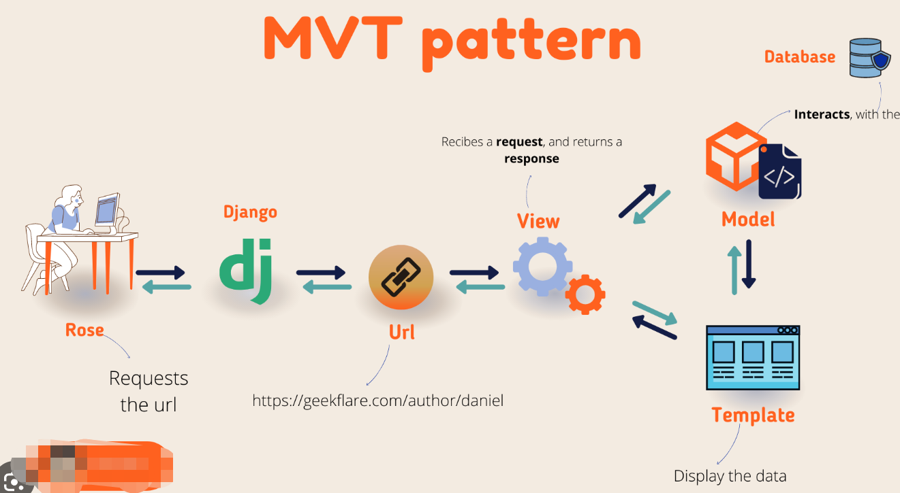

# **self taught diary**
## This is the diary for my journey to becoming a developer job by self-taught coding.

i'll keep every it concise and concludes what i've done on the day.
task of the day can be any of the bellow:
- solve problem on leetcode
- contribute on github
- build up own project
- learn something new

i know the journey may be very long and tough. i may pivat my target a few times.
but how can i view the scene without starting the journey. 
let's go.


interesting projects to do:
- personal profile page
- slot booking system
- backtesting framework

---
# 05/06/2023
- [x] work on leetcode 226, met the binary tree. 

the main takeaway is its sturcture and insert function that i can build a tree for testcase simulation
```python
# data structure:
class TreeNode(object):
    def __init__(self,val=0,left=None,right=None):
        self.val=val
        self.left=left
        self.right=right
# inset function
    def insert(self,val):
        if self.val:
            if val<self.val:
                if self.left is None:
                    self.left=TreeNode(val)
                else:
                    self.left.insert(val)
            elif val>self.val:
                if self.right is None:
                    self.right=TreeNode(val)
                else:
                    self.right.insert(val)
        else:
            self.val=val
# print tree
    def PrintTree(self):
        if self.left:
            self.left.PrintTree()
        print(self.val)
        if self.right:
            self.right.PrintTree()
```
there's 3 tree traversals: 
- in order traversal
- pre order traversal
- post order traversal

**further tasks**
- [x] get into detail of different traversals algorithm 
  - https://www.tutorialspoint.com/python_data_structure/python_tree_traversal_algorithms.htm
- [x] need to learn to mark a note in Markdown as well.
  - https://www.markdownguide.org/basic-syntax/#italic
  - https://docs.github.com/en/get-started/writing-on-github/getting-started-with-writing-and-formatting-on-github/basic-writing-and-formatting-syntax
- [x] after that leetcode problem is still not solved, need to carry on tmr.

**python takeaway:**
```python
# exchange value: 
a,b = b,a

# to create the input output loop function:
def function(init_input):
    next_input=2+init_input
    return function(next_input)
```

---
# 06/06/2023

**markdown takeaway:**

```markdown
click to the linked file: []()
[click to redirect to the file](./test_dict/test_py.py)

divider: ---

crossover line: ~~~text~~~

```
**algo takeaway**

binary tree traversals:
- inorder: left-root-right
- preorder: root-left-right
- postorder: left-right-root
```python
def inorder_traversal(self,root):
    res=[]
    if root:
        res=self.inorder_traversal(root.left)
        res.append(root.val)
        res=res+self.inorder_traversal(root.right)
    return res
  
def preorder_traversal(self,root):
    res=[]
    if root:
        res.append(root.val)
        res=res+self.preorder_traversal(root.left)
        res=res+self.preorder_traversal(root.right)
    return res

def postorder_traversal(self,root):
    res=[]
    if root:
        res=self.postorder_traversal(root.left)
        res=res+self.postorder_traversal(root.right)
        res.append(root.val)
    return res
```

- [x] leetcode 104: done the basic solution

**further task**
- [] need to learn deep to the better solution with queue/stack method

---
# 07/06/2023

**django takeaway**

debug for the url figuration 
https://stackoverflow.com/questions/49206835/django-urlconf-current-path-didnt-match
i've see the how to use urlpattern:
```python
# 'include' works for render all the project ruls after 'aaa/' :
path('aaa/', include('project.urls')),

```

to run the server:
```shell
py manage.py runserver
```

after create model, we need to describe it (create a record file in migration folder) by:
```shell
py manage.py makemigration project_name
```


for any change of model migration or adding application in 'settings.py': need to run below before running server
```shell
py manage.py migrate
```

sql database useful command:
```shell
py manage.py shell
import project_name.models import model_class #(database defination class)
data=model_class.objects.all()

# show values:
data.values()

#insert
insert_item= model_class(#self data fillment)
insert_item.save()

#update
existed_item=data[0]
existed_item.column_name=something
existed_item.save()

#delete
remove_item=data[0]
remove_item.delete()

```

when adding extra columns in models DB, allow default value as null can avoid problem of non-nullable field: null=True
```python
add_column=models.CharField(null=True)
```

django tag: 
is used for applying logic function in html


**python takeaway**

use list as global variable without declaring it in the nested function
```python
res=[0]
    def increment():
      res[0]=res[0]+1
increment()

#it does't work if declearing :
res=0
```

**further tasks**
- [] work on leetcode 543, after failed to solve by myself,then i checked the solution. but still not really understand. got to step back for more practice of easy ones. and come back to redo it.
- [] need to further read:https://www.w3schools.com/django/django_queryset.php
- [] how to add link to jump over in markdown?
